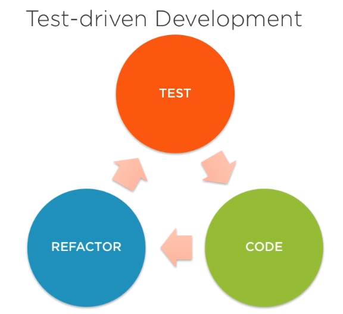

# TDD-React Counter APP

# Tr

Bu repoda, Test Driven Development (TDT) yaklaşımını kullanarak React kullanarak basit bir counter uygulamasının nasıl geliştirileceğini gösteriyoruz. TDT, geliştirilen kodun doğruluğunun test edilmesi ile başlamak üzere tasarım aşamasının yapılmasını önerir. Bu, kodun daha kaliteli ve hata içermez olmasını sağlar. Videoda, Jest ve Enzyme gibi popüler React test araçlarını kullanacağız. Uygulamanın başından sonuna kadar, her adımda test kodlarımızı yazacağız ve sonrasında da kodlarımızı geliştireceğiz. Sonunda, TDT yöntemi ile güvenli, doğru ve kaliteli bir counter uygulamasına sahip olacağız.

# En

In this repo, we demonstrate how to develop a simple counter application using React with the Test Driven Development (TDD) approach. TDD suggests starting with testing the accuracy of the code being developed, before moving on to the design phase. This ensures that the code is of higher quality and error-free. We will use popular React testing tools such as Jest and Enzyme in the video. From start to finish, we will write our test code with every step and then develop our code. In the end, we will have a secure, accurate and high-quality counter application using the TDD method.

